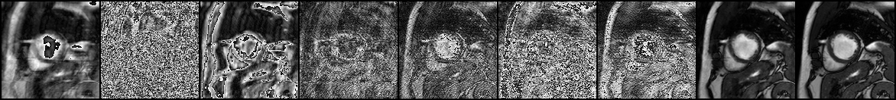

# Permutation-Invariant Variational Network MR Image Reconstruction


*The first figure is zero-padded reconstruction; the followings are sequential outputs or VN layers; and the last one 
is the ground truth.*

Please install the repo as editable library at the directory root:
```bash
pip install -e .
```
And copy `2d_knee.mat` and `2dt_heart.mat` into `data/` (or run `python scripts/test_repo_initialization.py` 
where downloading from polybox is added). Please install requisite packages by 
```bash
pip install -r requirements.txt
```
Please run `python scripts/test_repo_initialization.py` to see whether everything is properly initialized.
